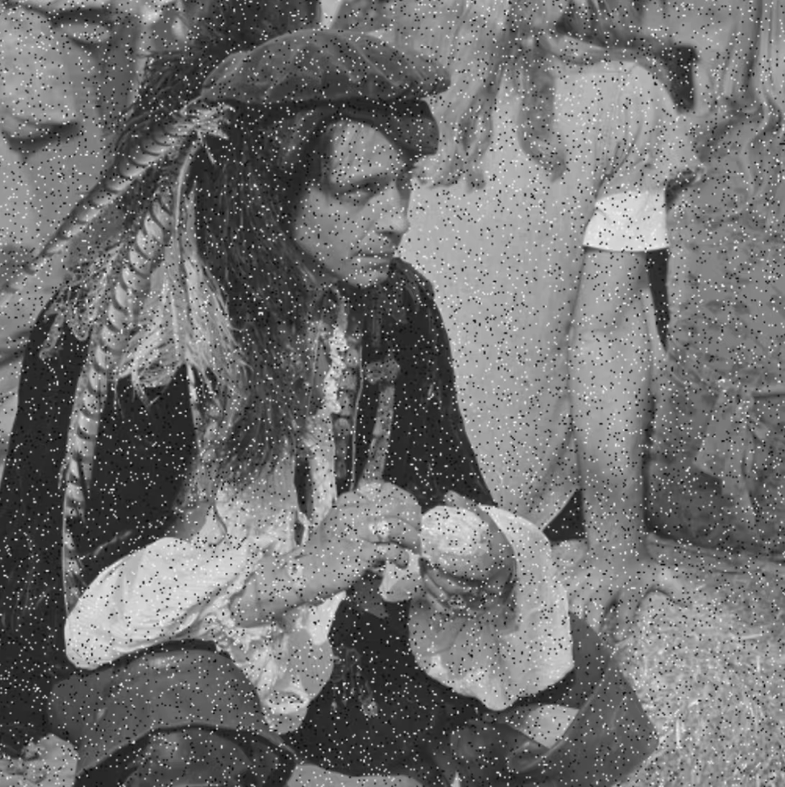
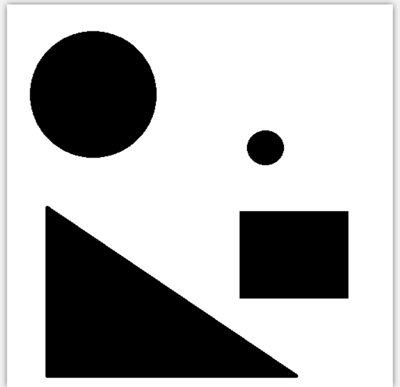
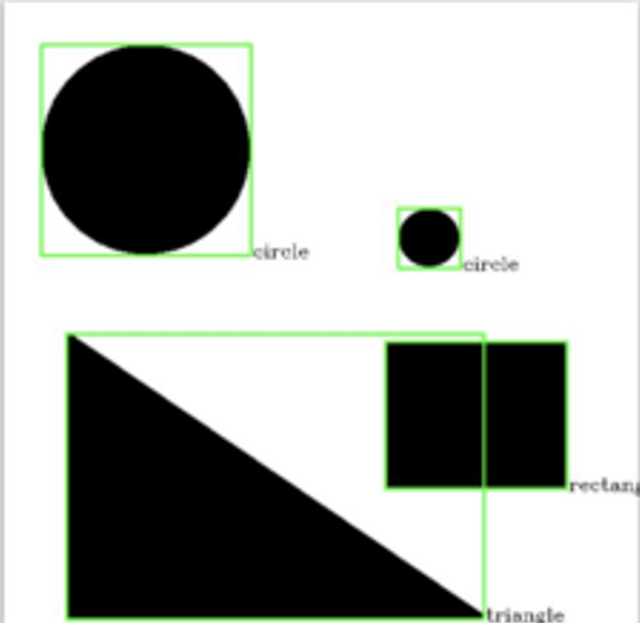
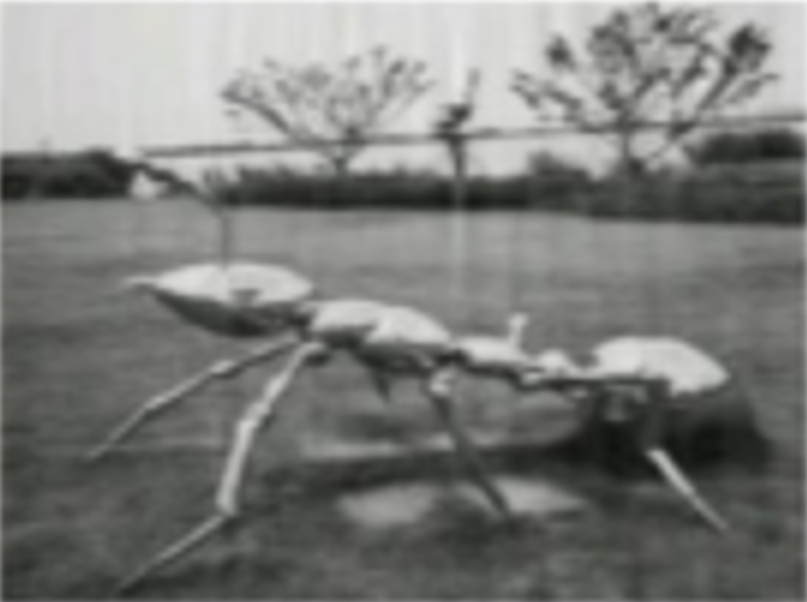

# 视觉组任务 2_1：

1. 配置 `opencv` 库，实现图像读取、显示（自选一张图即可，结果截图）。
2. 学习 `erode`、`blur`、`Canny` 函数并分别处理图片、保存（自选一张图即可，结果截图）。
3. 了解图像噪声的概念，自选图片添加任意一种噪声（自选一张图即可，结果截图，注明选用哪一种噪声）。
4. 使用“卷积核”进行图像滤波，完成任务。（已给定图片附件 1）

   使用均值滤波、高斯滤波两种方式对添加椒盐噪声的图片进滤波，完成图像去噪，比较效果。
5. 学习在不同色域中探索物体颜色属性。（已给定图片附件 2）
   * 有以下三类物体的图片：黄色方块、红色方块、绿色方块
   * 要求输入对应的图片时，能输出是哪类物体。（比如输入红色方块的一张图片，能输出一行字“红色方块”）
6. 区分出一些简单几何图形（比如圆，三角形，矩形等）。（已给定图片附件 3）

   * 在图片上框出图形，并标出图形类别。

   * 最终结果大致如图。
   

7. 对图像中的规律噪声进行滤波。（已给定图片附件 4）
   * 请使用傅里叶变换完成对图像中的规律噪声的滤波，完成图像去噪，比较使用该方法与使用卷积核滤波的区别。

   * 最终结果大致如图。

   

---

**注意：** 请将每一题的最终结果截图+源码上传到自己的仓库。最晚提交时间：2026-2-17 晚 23：59。