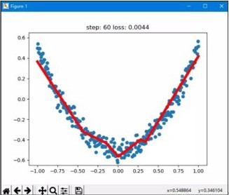

# 视觉组寒假/入门任务：深度学习与神经网络实战

欢迎来到视觉组！深度学习是计算机视觉的核心工具。本次任务旨在帮助大家从零开始，建立深度学习的基础概念，并具备动手编写和调试基础神经网络的能力。

## 阶段零：预习与基础理论（前置任务）

在动手敲代码之前，我们需要先建立对深度学习基本运行逻辑的认知。

**任务要求：**
1. **概念梳理**：通过查阅资料，了解深度学习中的基本概念。请将你对以下名词的理解，以及它们之间的相互关系，**用自己的话**总结成一个 Word/Markdown 文档（写得越直白、越生动越好，**严禁直接复制粘贴**）。
    * 需要包含的名词：神经元、前向传播、反向传播、激活函数、损失函数、优化器（梯度下降）、学习率。

---

## 阶段一：配置深度学习环境

工欲善其事，必先利其器。搭建一个稳定高效的开发环境是深度学习的第一步。

**任务要求：**
1. **选择框架**：建议在 **PyTorch** 或 **TensorFlow** 中选择一个作为你的主力框架（目前学术界和视觉比赛中，PyTorch 使用率更高，强烈建议首选 PyTorch）。
2. **本地安装**：
    * 推荐先安装 **Anaconda** 或 **Miniconda** 来管理 Python 环境。
    * 深度学习通常需要 GPU 加速（仅支持 NVIDIA 显卡）。如果有 N 卡，请尝试配置 CUDA 环境；如果没有独显，请选择安装 **CPU版本** 的深度学习框架。
    * **Tip**: 安装过程中，建议配置国内镜像源（如清华源、阿里源），以显著提高下载速度。
3. **云端算力（备选方案）**：如果电脑算力不足，鼓励大家自行“科学上网”并学会使用免费的云端 GPU 资源，如 **Google Colab** 或 **Kaggle Notebooks**。

---

## 阶段二：初探深度学习 —— 散点集的二次回归

这个任务旨在让你熟悉深度学习框架的基本操作流程：如何定义数据、如何构建模型、如何计算损失、以及如何更新参数。

**任务要求：**
1. **数据准备**：使用 `numpy` 生成一组二次函数 y = ax^2 + bx + c 的散点数据，并在数据中**人为添加一些随机噪声**。
2. **模型拟合**：使用你安装的深度学习框架（PyTorch/Tensorflow）编写一个简单的神经网络模型，对这组带有噪声的散点进行二次回归拟合。
3. **过程可视化**：使用 `matplotlib` 库。要求在代码运行过程中，**实时动态显示**回归拟合的曲线逐渐逼近真实散点分布的过程（最终效果参考附件2-3的截图：蓝点为真实数据，红线为拟合曲线）。

---

## 阶段三：计算机视觉的 "Hello World" —— MNIST 手写数字识别

掌握了基本的回归后，我们将正式进入计算机视觉领域，使用卷积神经网络（CNN）来完成一个经典的分类任务。

**任务要求：**
1. **理论进阶**：在编写代码前，确保自己了解以下概念：**卷积层（Convolution）、池化层（Pooling）、全连接层（FC）、批次大小（Batch Size）、Epoch**。
2. **模型搭建**：使用 MNIST 数据集，自行设计或参考经典结构（如 LeNet）搭建一个**卷积神经网络**。
3. **训练与监控**：
    * 在训练过程中，要求实时在终端（或可视化面板）打印出当前训练的 **Epoch、Step、Loss（损失值）** 以及在测试集上的 **Accuracy（准确率）**。
    * 自行尝试调试 `batch_size`、损失函数、优化器并理解其概念，观察它们对训练结果的影响。
4. **达标要求**：自行设计（或选择）神经网络，最终在测试集上结果需**达到 80%**。

**🌟 进阶挑战（学有余力的同学选做）：**
* 继续了解正则化、舍弃（Dropout）、池化等概念，对神经网络、超参数等内容进行优化。

---

## 📚 深度学习推荐学习资源

这里为大家整理了优质的学习资源，大家可以根据自己的学习习惯进行选择：

**视频与教程推荐：**
* **Bilibili**：（自行搜索即可）吴恩达 - 机器学习/深度学习（基础知识）
* **CS231n**：全称是《面向视觉识别的卷积神经网络，深度学习理论基础 CS231n》
    * 完整笔记参考：https://zhuanlan.zhihu.com/p/21930884
* **官方与公开课**：Tensorflow 官方教程、Tensorflow 北大慕课
* **实战推荐**：跟李沐学 AI（主要为机器学习和 Pytorch 实战）等等

> **注**：只要适合自己，均可。深度学习的学习曲线前期可能会比较陡峭，请多利用搜索引擎解决问题，加油！