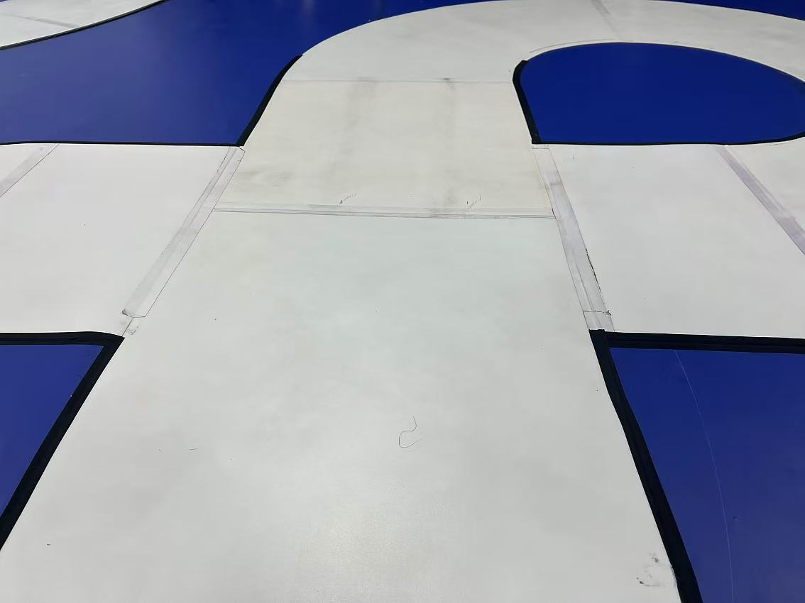
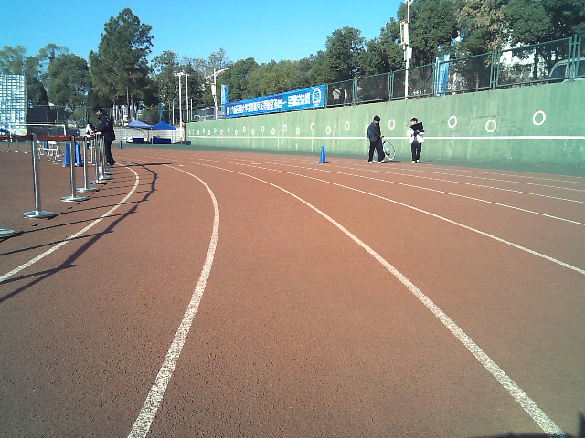
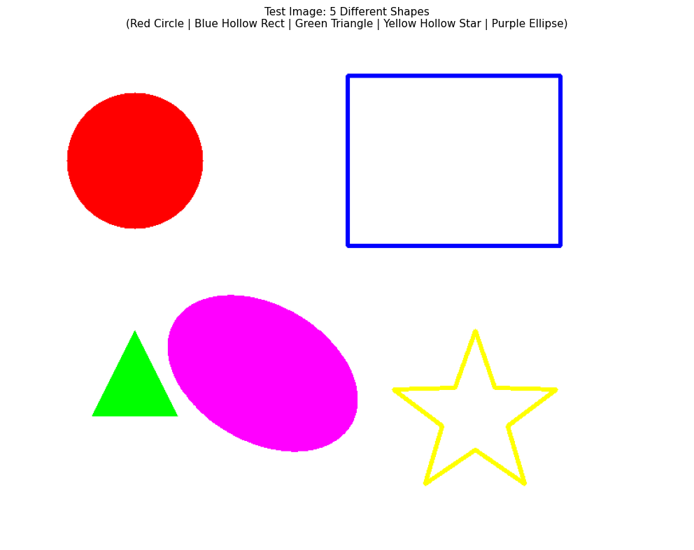
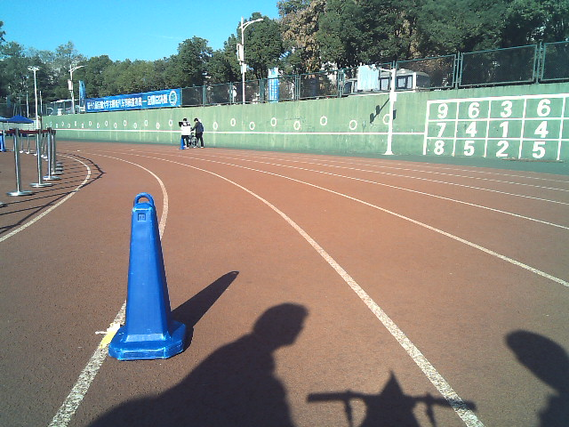

# 视觉组任务 4：目标特征提取与几何视觉基础

**前言：** 在任务三中，我们掌握了单张静态图片的预处理。但在实际的智能车比赛中，视觉系统需要从“动起来”的视频流中实时抓取特征。

---

## 1. 视频流基础与 ROI 截取
* **任务要求**：
    1. 读取一段视频文件（或直接调用电脑摄像头）。
    2. 在画面中心设置一个固定大小的矩形区域（ROI，Region of Interest）。
    3. **实时处理**：仅对 ROI 区域内的图像进行“灰度化”和“Canny 边缘检测”，并将处理后的黑白画面叠加回原彩色画面的对应位置。

    * ***预期效果***：画面中心有一个绿色的矩形框，框内是黑白的边缘线条，框外是正常的彩色画面。

## 2. 霍夫变换（Hough Transform）：寻找规则几何体
* **任务要求**：
    1. **直线检测**：找一张包含车道线或规则长方形边缘的图片，使用 `HoughLinesP` 提取直线，并在原图上用**红色**画出这些线段。
    2. **圆检测**：找一张包含硬币、台球或交通标志（圆）的图片，使用 `HoughCircles` 识别圆，并在图中画出圆心和圆周。

    * ***或可直接使用任务四图片附件 2-1。***
    

## 3. 透视变换（Perspective Transform）：上帝视角
* **背景**：摄像头安装在车上是倾斜的，看到的地面矩形会变成梯形。我们需要将其校正。
* **任务要求**：
    1. 自选一张包含倾斜矩形（如书本、地面上的瓷砖、或模拟赛道）的图片,或者直接使用任务四图片附件 3-1。
    2. 手动确定该矩形的四个顶点坐标。
    3. 使用 `getPerspectiveTransform` 计算变换矩阵。
    4. 使用 `warpPerspective` 将倾斜的目标区域“拉正”，输出一张正视的俯视图（Bird's Eye View）。

    

## 4. 轮廓特征筛选：从“看到”到“识别”
* **任务要求**：给定一张包含多个形状（大小不一、颜色不同、有实心有空心）的复杂图片，见任务四图片附件4-1。
    1. 提取所有轮廓。
    2. 通过代码逻辑筛选出**面积最大**的那个形状。
    3. 通过**周长/面积比**或**凸包（Convex Hull）**判断，筛选出其中“最不规则”的物体。
    4. 在原图上框出筛选结果，并实时打印该形状的面积数值。
    

## 5. 交互式调参工具：HSV 动态遮罩
* **任务要求**：
    1. 编写一个程序，创建一个名为 `Control` 的窗口，并在其中设置 6 个 **Trackbar（滑动条）**，分别控制 HSV 的 H_min, H_max, S_min, S_max, V_min, V_max。
    2. 实时读取一张彩色图片，根据滑动条的数值生成二值化 Mask（掩膜）。
    3. **最终目标**：通过手动调节滑动条，能够精准地在复杂背景中抠出一个特定颜色的物体（如蓝色锥桶）。
    

---

## 📝 提交规范

1. **截止时间**：2026-2-20
2. **提交形式**：
   * 请将每道题的**源码**上传至仓库。
   * 务必附带**运行结果截图**或 **视频段落**。

---
**提示**：智能车的视觉不仅仅是调库，更多的是对“噪声”和“光照”的对抗。加油！